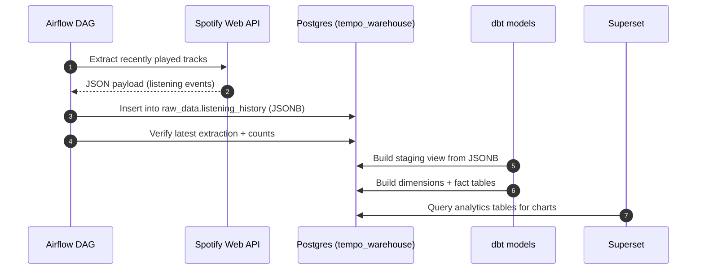
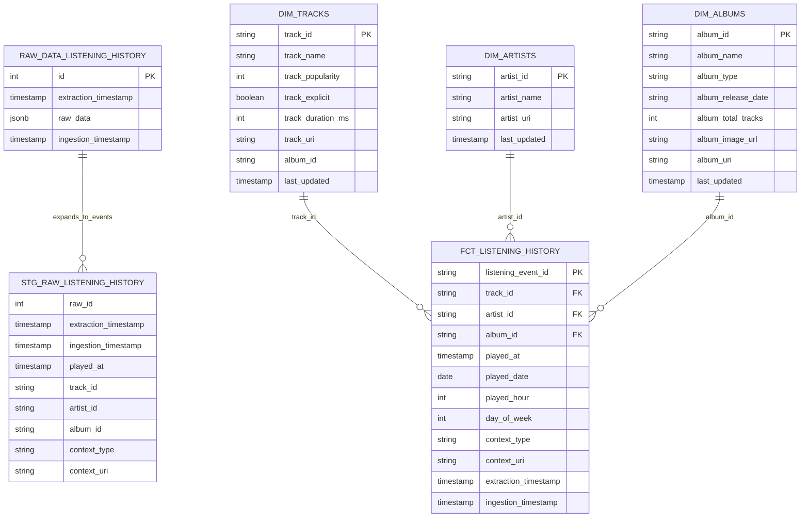

# Tempo

Tempo is a small data pipeline that extracts Spotify listening history, lands the raw payload in PostgreSQL, transforms it into analytics-friendly tables with dbt, and makes it available for exploration in Apache Superset.

## Technologies used

- Python (backend extraction code)
- Spotify Web API via `spotipy`
- Environment configuration via `python-dotenv`
- Apache Airflow (orchestration)
- PostgreSQL 15 (Airflow metadata + `tempo_warehouse` data warehouse)
- dbt (`dbt-postgres`) for transformations and tests
- Docker Compose (local orchestration of services)
- Apache Superset (BI / dashboards)

## Repository layout

- `backend/`
  - `main.py`: local runner for extraction + JSON write
  - `modules/Extract.py`: `SpotifyExtractor` (Spotify API client + normalization)
  - `data/`: raw JSON files written by the local runner
  - `logs/`: extraction logs
- `airflow/`
  - `dags/spotify_ingestion_dag.py`: scheduled ingestion DAG (extract → load → verify)
- `sql/init_db.sql`: initializes the `tempo_warehouse` database and raw landing table
- `tempo_analytics/`: dbt project that builds staging + analytics tables from raw JSON
- `docker-compose.yml`: local stack (Postgres, Airflow, Superset)

## Configuration

Tempo expects Spotify API credentials to be provided as environment variables:

- Local `backend/main.py`:
  - `CLIENT_ID`
  - `CLIENT_SECRET`
  - `REDIRECT_URL`

- Docker/Airflow stack (wired through `docker-compose.yml`):
  - `SPOTIFY_CLIENT_ID` (from `CLIENT_ID`)
  - `SPOTIFY_CLIENT_SECRET` (from `CLIENT_SECRET`)
  - `SPOTIFY_REDIRECT_URI` (from `REDIRECT_URL`)

## Architecture

```mermaid
flowchart LR
  subgraph External
    Spotify[Spotify Web API]
  end

  subgraph Docker_Stack[Docker Compose]
    AWeb[Airflow Webserver]
    ASched[Airflow Scheduler]
    AInit[Airflow Init]
    PG[(PostgreSQL 15)]
    Superset[Apache Superset]
  end

  subgraph Code
    DAG[airflow/dags/spotify_ingestion_dag.py]
    Extractor[backend/modules/Extract.py\nSpotifyExtractor]
    DBT[tempo_analytics (dbt project)]
  end

  AWeb --- ASched
  AInit --> AWeb
  AInit --> ASched

  ASched --> DAG
  DAG --> Extractor
  Extractor --> Spotify

  DAG --> PG
  DBT --> PG
  Superset --> PG
```

## Data flow



## Warehouse schema

### Raw landing

- `tempo_warehouse.raw_data.listening_history`
  - Stores each extraction as a single JSONB payload (`raw_data`) with an `extraction_timestamp`.

### Transformations (dbt)

The dbt profile in `profiles.yml` uses `schema: analytics`. With dbt's default schema naming, models configured with `+schema: staging` and `+schema: analytics` are created as:

- `tempo_warehouse.analytics_staging` (staging views)
- `tempo_warehouse.analytics_analytics` (dimension/fact tables)

This matches the schema names referenced in `tempo_analytics/target/` artifacts.

## Relational diagram (analytics star schema)


